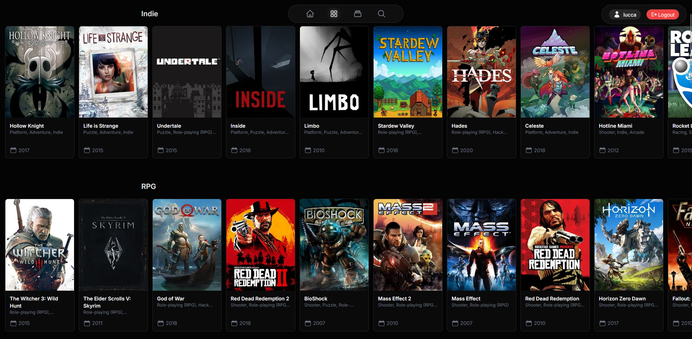
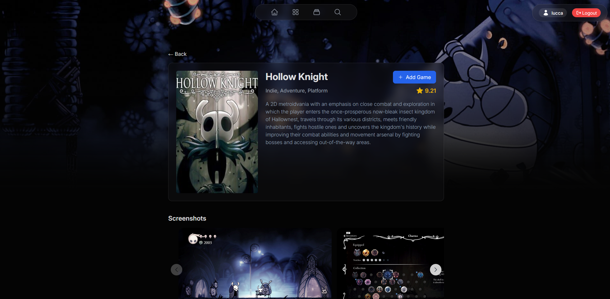

# Game List

Game List is a project for tracking and managing games. This repository aims to provide a simple and efficient way to organize, search, and display a collection of games.

## Screenshots

### Game List home page

### Discover page

### Game Details page

## Features

- Add, edit, and remove games from your list
- View details for each game
- Search and filter games
- Responsive and user-friendly interface

## Usage

Once running, you can:

- Add new games to your list
- View and search your collection
- Edit or delete existing entries

## Contributing

Contributions are welcome! Please open an issue or submit a pull request.

1. Fork the repository
2. Create a new branch (`git checkout -b feature-branch`)
3. Make your changes
4. Commit and push
5. Open a pull request

## License

This project is licensed under the MIT License. See the [LICENSE](LICENSE) file for details.

## Author

Made with ❤️ by [LuccaHeineck](https://github.com/LuccaHeineck).
